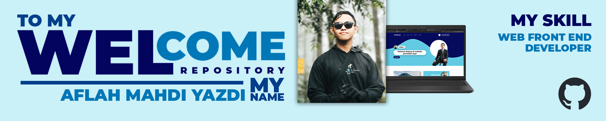

# Hi , I'm Aflah Mahdi Yazdi 

  

I am a passionate developer focused on building efficient and modern applications. My expertise spans across web development, desktop applications with Rust, and experimenting with local AI implementations.

---

### 🛠️ Tech Stack

#### 🚀 Languages

#### 🖼️ Frameworks & Libraries

#### 🤖 Artificial Intelligence (Local LLMs)
 

*Specialized in local AI integration and self-hosted LLM workflows.*

---

### 📊 GitHub Stats
 

---

### 🤝 Connect with me

---

  <i>"Building the future, one line of code at a time."</i>

<!--
**MasYaaz/MasYaaz** is a ✨ _special_ ✨ repository because its `README.md` (this file) appears on your GitHub profile.

Here are some ideas to get you started:

- 🔭 I’m currently working on ...
- 🌱 I’m currently learning ...
- 👯 I’m looking to collaborate on ...
- 🤔 I’m looking for help with ...
- 💬 Ask me about ...
- 📫 How to reach me: ...
- 😄 Pronouns: ...
- ⚡ Fun fact: ...
-->
